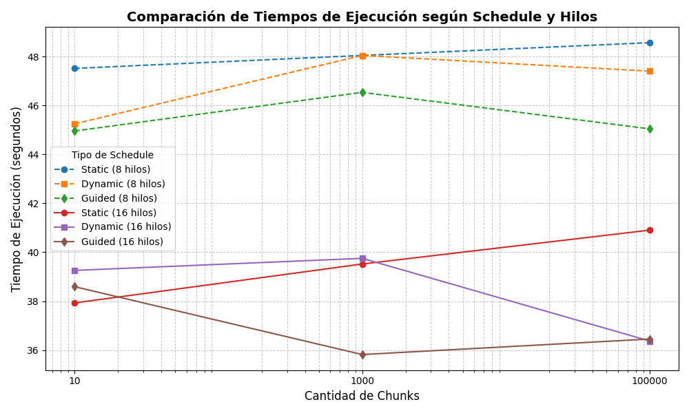
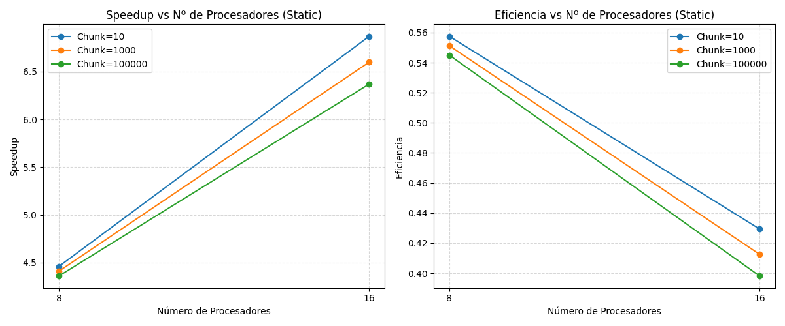
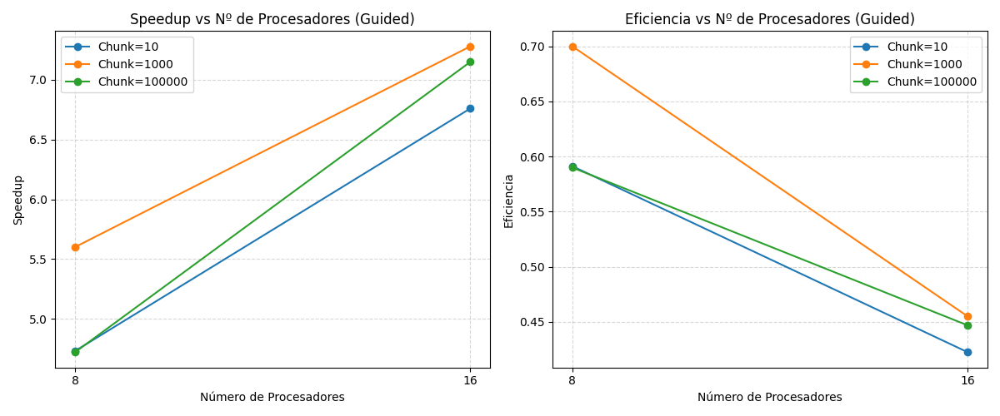

# 🧮 T1_HCP

## 📊 Resultados

### 🔹 Resultados de referencia (versión secuencial)

| Parámetro | Valor |
|------------|--------|
| **Rango evaluado** | 2 → 400,000,000 |
| **Primos encontrados** | 21,336,326 |
| **Tiempo de ejecución** | ⏱️ 260.809 segundos |

### 🔹 Resultados Version Paralela

#### Schedule(static)

| Chunks | Parámetro | 8 Hilos | 16 Hilos |
|:-------|:-----------|:--------|:----------|
| **10** | **Tiempo de ejecución** | ⏱️ 47.5133 s | ⏱️ 37.9286 s |
|  | **Speedup** | 4.46× | 6.87× |
| **1000** | **Tiempo de ejecución** | ⏱️ 48.044 s | ⏱️ 39.520 s |
|  | **Speedup** | 4.41× | 6.60× |
| **100000** | **Tiempo de ejecución** | ⏱️ 48.5659 s | ⏱️ 40.9047 s |
|  | **Speedup** | 4.36× | 6.37× |

#### Schedule(dynamic)

| Chunks | Parámetro | 8 Hilos | 16 Hilos |
|:-------|:-----------|:--------|:----------|
| **10** | **Tiempo de ejecución** | ⏱️ 45.2478 s | ⏱️ 39.2581 s |
|  | **Speedup** | 4.70× | 6.64× |
| **1000** | **Tiempo de ejecución** | ⏱️ 48.0436 s | ⏱️ 39.752 s |
|  | **Speedup** | 4.41× | 6.56× |
| **100000** | **Tiempo de ejecución** | ⏱️ 47.4016 s | ⏱️ 36.3698 s |
|  | **Speedup** | 4.47× | 7.17× |

---

#### Schedule(guided)

| Chunks | Parámetro | 8 Hilos | 16 Hilos |
|:-------|:-----------|:--------|:----------|
| **10** | **Tiempo de ejecución** | ⏱️ 44.956 s | ⏱️ 38.5945 s |
|  | **Speedup** | 4.73× | 6.76× |
| **1000** | **Tiempo de ejecución** | ⏱️ 46.535 s | ⏱️ 35.820 s |
|  | **Speedup** | 5.60× | 7.28× |
| **100000** | **Tiempo de ejecución** | ⏱️ 45.042 s | ⏱️ 36.4544 s |
|  | **Speedup** | 4.72× | 7.15× |

### 📈 Gráfico Comparativo de Tiempos

Los siguientes resultados ilustran el comportamiento de los tres *schedules* (`static`, `dynamic`, `guided`) con diferentes cantidades de *chunks* y hilos.

## ⚙️ Gráficos de Speedup y Eficiencia vs Nº de Procesadores

A continuación se presentan los gráficos generados a partir de los resultados experimentales para cada tipo de *schedule*. Estos gráficos permiten analizar cómo varía la aceleración (Speedup) y la eficiencia del paralelismo al aumentar el número de procesadores.

---

### 🔸 Schedule Static

---

### 🔸 Schedule Dynamic

---

### 🔸 Schedule Guided

---

### 🧠 Análisis de Speedup y Eficiencia vs N° Procesadores

En todos los schedules, se observa que el speedup crece al aumentar el número de procesadores, lo cual confirma que el algoritmo se beneficia del paralelismo. Sin embargo, la eficiencia disminuye conforme aumentan los hilos, lo que refleja la pérdida de rendimiento relativo debido a la sobrecarga de sincronización, el costo de dividir las tareas y la parte secuencial del código, lo que es esperado en sistemas paralelos reales debido a la ley de Amdahl como vimos en clases.

El schedule static asigna bloques de iteraciones de tamaño fijo a cada hilo, obteniendo speedups desde 4.3x a 6.8x y una eficiencia que cae de 0,55 a 0,43 al duplicar el número de hilos. Esto puede deberse a que los números primos no se distribuyen uniformemente entre los 400 millones a indagar pues los primeros rangos tienen más trabajo al frecuentar más primos que al final, causando que algunos hilos puedan terminar antes esperando el procesamiento de otros. Se puede apreciar que este efecto empeora con un mayor tamaño de chunks pues cada hilo recibe menos bloques con peor granularidad, siendo chunk=10 el caso con un mayor rendimiento para este schedule.

El schedule dynamic por su parte comienza como el static con una asignación fija pero luego reasigna bloques de trabajo a medida que los hilos terminan mejorando el balance de carga. Se puede ver que el speedup mejora ligeramente frente al static al distribuir el trabajo de cada hilo según su disponibilidad pero con el sacrificio de overhead al tener que reasignar estos bloques dinámicamente y asegurar sincronización. Por esta razón, se puede observar que con chunk=10 la ganancia de balance no compensa el costo de reasignación, en cambio con mayor tamaño de chunks se logra un equilibrio más eficiente con un speedup de 7.17x ya que el overhead se equilibra con la flexibilidad de reasignación ante irregularidades en la búsqueda.

Por último, el schedule guided asigna inicialmente bloques grandes y luego los va reduciendo dinámicamente, combinando ambas estrategias antes mencionadas. Se pueden apreciar speedups más altos como 7.28x con 16 hilos y chunk=1000, con este tamaño inicial de chunk se obtienen los mejores resultados tanto en speedup como en eficiencia lo que sugiere ser un tamaño ideal para la búsqueda de primos que son más frecuentes en un comienzo que al final de la búsqueda. Un menor tamaño de chunks aumenta mucho la fragmentación causando mayor sobrecarga, mientras que uno grande no aprovecha efectivamente la estrategia de distribución de bloques.
